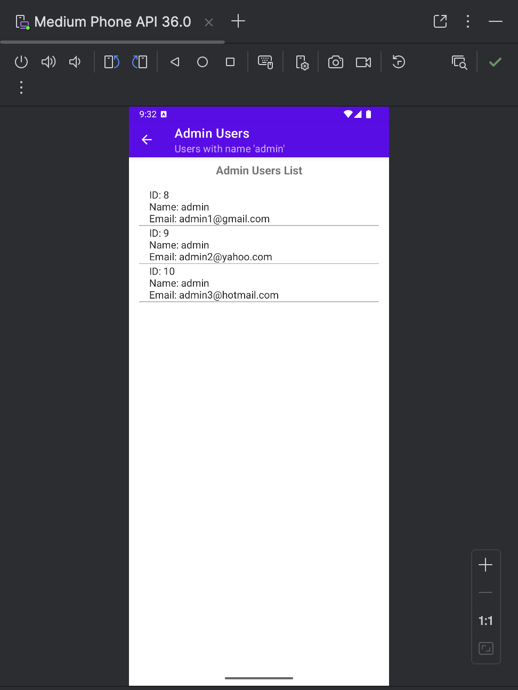

# Simple Personal Organizer

## Question A: Set up the Simple Personal Organizer Project
- [X] Name the Project as SimplePersonalOrganizer_2023ebcs701
- [X] Empty Activity template + project targets API level 24 (Nougat) or higher.
- [X] Configure package name and app settings
- [X] DatabaseHelper: database helper class
- [X] Define User Table (id, name, email)

### Deliverable:
- [X] Project Structure Screenshot
- [X] Configuration Screenshot
- [X] DatabaseHelper class code Screenshot

#### File Structure

```sh
SimplePersonalOrganizer_2023ebcs701
├── app/
│   ├── build/
│   ├── build.gradle.kts
│   ├── proguard-rules.pro
│   └── src/
│       ├── androidTest/
│       ├── main/
│       │   ├── AndroidManifest.xml
│       │   ├── java/
│       │   │   └── com/
│       │   │       └── Shrimay/
│       │   │           └── simplepersonalorganizer/
│       │   │               ├── DatabaseHelper.kt
│       │   │               ├── MainActivity.kt
│       │   │               ├── UserListActivity.kt       // ProfileActivity
│       │   │               └── ui/
│       │   └── res/
│       │       ├── drawable/
│       │       ├── layout/
│       │       │   ├── activity_main.xml
│       │       │   └── activity_user_list.xml
│       │       ├── mipmap-anydpi-v26/
│       │       ├── mipmap-hdpi/
│       │       ├── mipmap-mdpi/
│       │       ├── mipmap-xhdpi/
│       │       ├── mipmap-xxhdpi/
│       │       ├── mipmap-xxxhdpi/
│       │       ├── values/
│       │       │   ├── colors.xml
│       │       │   ├── strings.xml
│       │       │   └── themes.xml
│       │       └── xml/
│       └── test/
├── build/
├── build.gradle.kts
├── gradle/
├── gradle.properties
├── gradlew
├── gradlew.bat
├── images/
├── local.properties
├── README.md
└── settings.gradle.kts
```


#### Configuration

Please refer to `app/build.gradle.kts` to get app-level Gradle configuration.

#### DatabaseHelper class


## Question B: Design the Information Form
- [X] EditText elements + TextView labels
- [X] Save Button
- [X] Basic styling (padding + margin)
- [X] Display a success message upon saving the data.

### Deliverable:
- [X] XML layout file (activity_main.xml)
- [X] MainActivity.kt file
- [X] screenshot of the form showing sample data saved in the database

#### Preview on Device


#### Information Form Layout (UI)


#### Confirmation Message on Save


#### Stored Data Verification (Database View)


## Question C: Implement Navigation and Data Retrieval
- [X] Add a new activity named UserListActivity
- [X] Use the DatabaseHelper class to retrieve all user records from the Users table only for user named `admin`
- [X] Display the retrieved data in a ListView, showing Name and Email.
- [X] Add a `View All Users` button in the main form to navigate to the UserListActivity

### Deliverable:
- [X] UserListActivity.kt file
- [X] screenshot showing the list of users displayed on the screen

#### List of Retrieved Admin Users


#### Confirmation Toast: Admin Users Found
